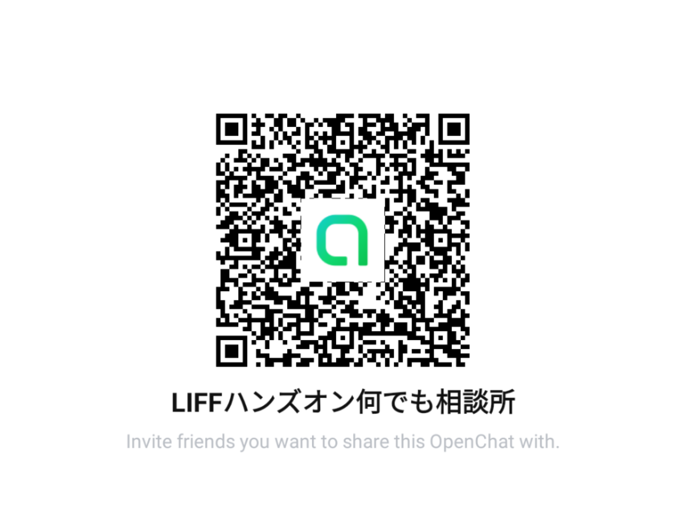

# はじめに

## LIFF とは

```
LINE Front-end Framework（LIFF）は、LINEが提供するウェブアプリのプラットフォームです。
このプラットフォームで動作するウェブアプリを、LIFFアプリと呼びます。
```

[公式: LINE Front-end Framework](https://developers.line.biz/ja/docs/liff/overview/)より

## LIFF(LINE 内アプリ)の可能性

-   いつもの UI で使える

    -   [7 年使われなかったアプリも大盛況、「LINE 内アプリ」が流行るワケ](https://diamond.jp/articles/-/213614)

-   アプリをインストールする必要がない

    -   [日本市場モバイルアプリエンゲージメントレポート](https://www.fnn.jp/posts/000000047_000011908/201910231030_PRT_PRT)

-   通信量が少なくなる

    -   [Chrome Dev Summit at 2017](https://twitter.com/lukew/status/922593387449958400?s=19)

## LIFF v2 リリース 🎉

### これまで

-   LINE のユーザー情報取得
-   LINE にメッセージ送信

が LINE 内からのみ可能だった。

### v2 で増えたこと

-   外部ブラウザで LIFF アプリが動作するように！
-   ユーザーのプロフィール情報とメールアドレスを取得(LINE ログイン)可能に！
-   QR コードの読み取りが可能に！
-   LIFF アプリの動作環境を細かく取得可能に！  
    -> 動作している OS(iOS, Android, Web), LINE 内かどうか, 言語

[公式: LIFF v2 がリリースされました](https://developers.line.biz/ja/news/2019/10/16/)より

## このハンズオンの目標

1. LIFF 開発の基本を知る
2. ポイントカードアプリを作ってみる
3. ポイントカードアプリをより実用的に改良する(チャレンジ目標！)

## オープンチャット



[戻る](README.md) | [次へ](step1.md)
