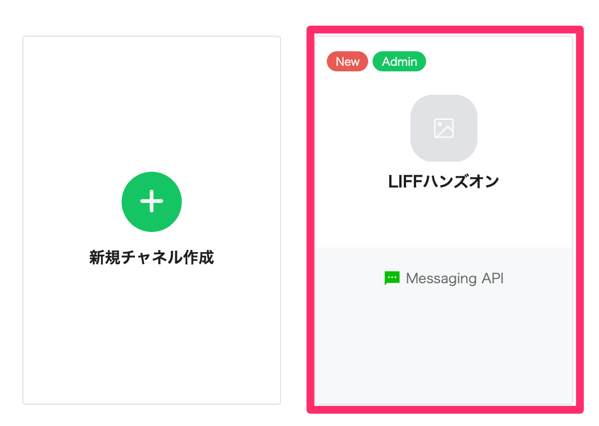
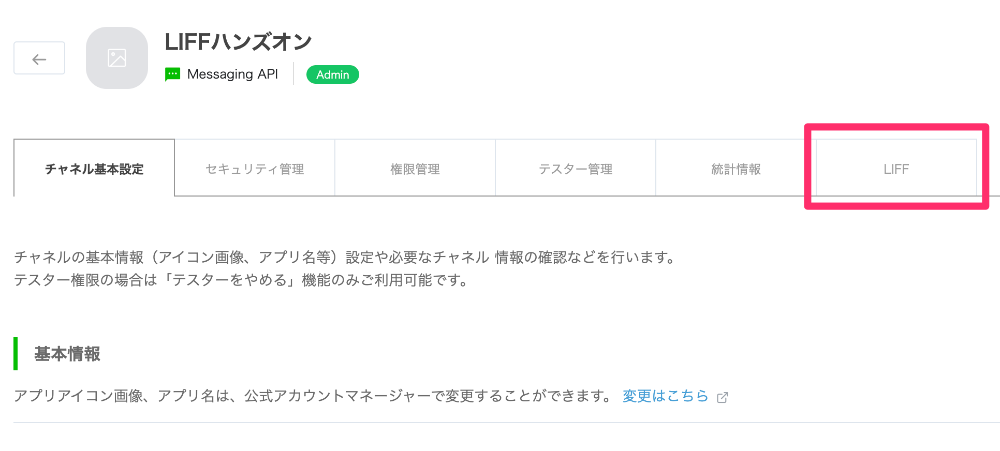

# 環境構築

## LINE ボットのチャネル開設

[1 時間で LINE BOT を作るハンズオン #作ってみよう](https://qiita.com/n0bisuke/items/ceaa09ef8898bee8369d#%E4%BD%9C%E3%81%A3%E3%81%A6%E3%81%BF%E3%82%88%E3%81%86)

## Node.js の確認

```
$ node -v
v10.16.0
```

このハンズオンは v10 で動作を確認しています。

[Node.js のインストール](https://nodejs.org/ja/)

## LIFF アプリの環境設定

1. [こちらから](https://github.com/morugu/liff-hands-on/archive/master.zip)ハンズオン用コードのダウンロードをしてください。

2. .zip を展開し、エディターで開いてください。

3. 初期設定とサーバー立ち上げ

このハンズオンではすべての操作を `app/` ディレクトリ配下で行います。

```
$ cd app
$ npm install
$ npm run start
```

ブラウザで http://localhost:5000 を開いて、アクセスできることを確認してください。

## 外部からアクセスできるようにする

### ngrok のインストール

1. ダウンロード  
   https://ngrok.com/download

2. .zip を展開する

3. ngrok コマンド実行

```
$ ./ngrok http 5000
```

※セキュリティ警告が出る場合は、`ngrok` ファイルを右クリック(Mac は 2 本指打タップ)で開いて実行してから、コマンドを実行してください。

4. URL からアクセス確認

Forwarding に表示されている https からはじまる URL にアクセスしてください。  
表示が確認ができたら `https://xxx.ngrock.io` をメモしておきましょう(以降 `Web URL` と呼びます)

## LIFF の追加

1. LINE Developers Console にアクセス

https://developers.line.biz/console/

2. [LINE ボットのチャネル開設]で作成したチャネルにアクセス



3. [LIFF] をクリック



4. [追加]をクリック

5. 各種情報を入力して[追加]をクリック

-   名前: `ポイントカード`
-   サイズ: `Compact`
-   エンドポイント URL: `https://xxx.ngrock.io` ※ngrok で発行された `Web URL` を設定する
-   Scope: `profile` にチェックを入れる
-   オプション:
    -   BLE feature: `OFF`
    -   ScanQR: `ON`

6. [追加する]をクリック

7. 発行された `LIFF URL` を確認

`line://app/xxxxxxxxxx-xxxxxxxx` をメモしておいてください。

`xxxxxxxxxx-xxxxxxxx` の部分を `LIFF ID` と呼びます。

[戻る](step0.md) | [次へ](step2.md)
